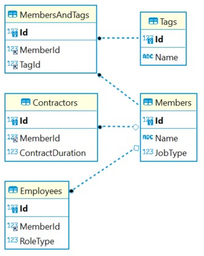

# Table of Contents

- [Instructions](#instructions)
  - [Features and Requirements](#features-and-requirements)
- [Solution](#solution)
  - [Requirements](#requirements)
  - [How to run](#how-to-run)
  - [Types of Members (JobTypes)](#types-of-members-jobtypes)
  - [Types of Roles (RoleType)](#types-of-roles-roletype)
  - [Tags](#tags)
  - [Database Schema](#database-schema)
  - [Possible improvements](#possible-improvements)
- [Requests & Responses](#requests--responses)
  - [Contractor](#contractor)
  - [Employee](#employee)
  - [Admin](#admin)
  - [CommonMember](#commonmember)

## Instructions

The goal is to create a backend using C# using and the REST arquitecture.

### Features and Requirements

- A member has a name and a type, the latter one can be one: employee or contractor.
- - If the member it's a contractor, the duration of the contract must be stored as an integer in the database.
- - If the member it's an employee, a role must be stored in the database, for instance: Software Engineer, Project Manager and so on.
- A member can be tagged, for instance: C#, Angular, General Frontend, Seasoned Leader and so on. (Tags will likely be used as filters later)
- Use REST CRUD for all the information above.

## Solution

### Requirements

- Docker
- Docker-Compose
- NetCore 3.1

### How to run

The project was setup just to run `docker-compose up` inside the `InterviewProject` folder. It will create two containers:

- NetCore where the project will be running.
- MySQL database.

It may fail at the very beginning because the database takes a bit longer to setup than the NetCore project but it will restart automatically and should be able to connect and run the migrations.

Alternatively, another way is to run a MySql container and run the project locally: `docker run -p 3306:3306 --name mysql-docker-local -e MYSQL_ROOT_PASSWORD=pass -e MYSQL_DATABASE=interviewdb -e MYSQL_USER=user -e MYSQL_PASSWORD=pass -d mysql:5.7` The project has the configuration file (appSettings.json) pointing to a database with that information.

### Types of Members (JobTypes)

There is a enum with the following JobTypes:
1. Contractors
2. Employees

### Types of Roles (RoleType)

There is an enum with the following RoleTypes:

1. SoftwareEngineer
2. ProjectManager
3. DeliveryManager
4. ScrumMaster

### Tags

The following tags are created when running the migrations:

1. C#
2. Python
3. Ruby
4. Java
5. Angular
6. NodeJS
7. NetCore
8. Flutter
9. React Native
10. C++
11. JavaScript

### Database Schema



### Possible improvements

- Add security based on JWT
- Add security on the endpoints based on roles
- Add Swagger
- Add logging with SignalFX, NewRelic
- Database already loaded in the cloud so the project connects there
- Deploy the solution using container orchestrator, like Kubernetes
- Integration tests
- Pagination on the search endpoints

## Requests & Responses

### **Contractor**

_GET_ `/api/contractor`

**Request**: -

**Response**:

```json
{
  "Count": 1,
  "Contractors": [
    {
      "ContractDuration": 3,
      "Id": 1,
      "Name": "Test",
      "JobType": 1,
      "Tags": [4, 5]
    }
  ]
}
```

_GET_ `/api/contractor/{id}`

**Request**: -

**Response**:

```json
{
  "ContractDuration": 3,
  "Id": 1,
  "Name": "Test",
  "JobType": 1,
  "Tags": [4, 5]
}
```

_POST_ `/api/contractor`

**Request**:

```json
{
  "name": "Test",
  "contractDuration": 3,
  "tags": [4, 5]
}
```

**Response**:

```json
{
  "ContractDuration": 3,
  "Id": 1,
  "Name": "Test",
  "JobType": 1,
  "Tags": [4, 5]
}
```

_PUT_ `/api/contractor/{id}`

**Request**:

```json
{
  "name": "UpdateTest",
  "contractDuration": 12,
  "tags": [8]
}
```

**Response**:

```json
{
  "ContractDuration": 12,
  "Id": 1,
  "Name": "UpdateTest",
  "JobType": 1,
  "Tags": [8]
}
```

_DELETE_ `/api/contractor/{id}`

**Request**: -

**Response**: -

### **Employee**

_GET_ `/api/employee`

**Request**: -

**Response**:

```json
{
  "Count": 1,
  "Employees": [
    {
      "RoleType": 2,
      "Id": 2,
      "Name": "EmployeeName",
      "JobType": 2,
      "Tags": [4, 7]
    }
  ]
}
```

_GET_ `/api/employee/{id}`

**Request**: -

**Response**:

```json
{
  "RoleType": 2,
  "Id": 2,
  "Name": "EmployeeName",
  "JobType": 2,
  "Tags": [4, 7]
}
```

_POST_ `/api/employee`

**Request**:

```json
{
  "name": "EmployeeName",
  "roleType": 2,
  "tags": [4, 7]
}
```

**Response**:

```json
{
  "RoleType": 2,
  "Id": 2,
  "Name": "EmployeeName",
  "JobType": 2,
  "Tags": [4, 7]
}
```

_PUT_ `/api/employee/{id}`

**Request**:

```json
{
  "name": "OtherName",
  "roleType": 3,
  "tags": [3, 4]
}
```

**Response**:

```json
{
  "RoleType": 3,
  "Id": 2,
  "Name": "OtherName",
  "JobType": 2,
  "Tags": [3, 4]
}
```

_DELETE_ `/api/employee/{id}`

**Request**: -

**Response**: -

### **Admin**

_POST_ `/api/admin/tag`

**Request**:

```json
{
  "name": "C"
}
```

**Response**: -

### **CommonMember**

_GET_ `/api/commonmember`

**Request**: -

**Response**:

```json
{
  "Count": 2,
  "Contractors": [
    {
      "ContractDuration": 12,
      "Id": 3,
      "Name": "UpdateTest",
      "JobType": 1,
      "Tags": [8]
    }
  ],
  "Employees": [
    {
      "RoleType": 3,
      "Id": 2,
      "Name": "OtherName",
      "JobType": 2,
      "Tags": [3, 4]
    }
  ]
}
```

_GET_ `/api/commonmember/search?tags=8&tags=4`

**Request**: -

**Response**:

```json
{
  "Count": 2,
  "Contractors": [
    {
      "ContractDuration": 12,
      "Id": 3,
      "Name": "UpdateTest",
      "JobType": 1,
      "Tags": [8]
    }
  ],
  "Employees": [
    {
      "RoleType": 3,
      "Id": 2,
      "Name": "OtherName",
      "JobType": 2,
      "Tags": [3, 4]
    }
  ]
}
```
